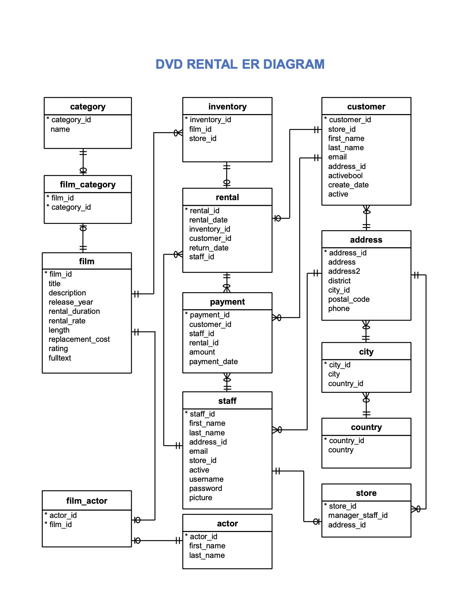

# Sakila DVD Rental Database

In this project, we have queried the Sakila DVD Rental database. The Sakila Database holds information about a company that rents movie DVDs.In order to understand the customer base for this project, we have queried the database to see how different customer groups compare in terms of payment earnings, the performance of the stores, and patterns in movie viewing.

## Supporting Materials
**Sakila DVD Rental database ER DIAGRAM**  
The Sakila Database holds information about a company that rents movie DVDs. 
For this project, we will be querying the database to gain an understanding of the customer base, such as what the patterns in movie watching are across different customer groups, how they compare on payment earnings, and how the stores compare in their performance.  
And here is the schema for the DVD Rental database is provided below.

**In this project, I will write queries for the following questions:**
- Create a query that lists each movie, the film category it is classified in, and the number of times it has been rented out.
- Write a query that returns the store ID for the store, the year and month and the number of rental orders each store has fulfilled for that month. 
- find a list of  movies, types, and description where the movie length was more than 60 minutes
- find each actor who has made the maximum number of movies with a PG-13 rating

*THANK YOU!*
